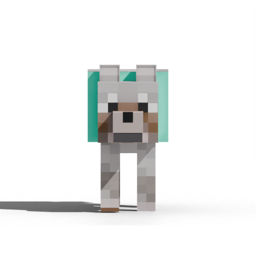
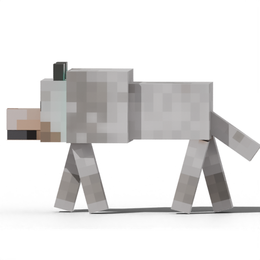
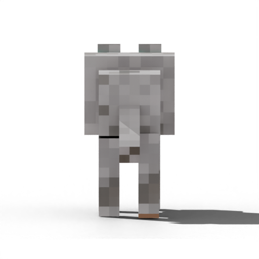

# 🐺 Pudding — Minecraft Wolf Desktop Pet

> A 3D Minecraft-style wolf that lives on your desktop. His name is **Pudding** (布丁).  
> Built with Blender (rendering) + PyQt6 (display). Runs on **macOS** and **Windows**.



---

## Features

| Front | Side | Back |
|:---:|:---:|:---:|
|  |  |  |

3D walk animation · 12 rotation angles · directional shadow · always-on-top · frameless transparent window · optional gaze tracking

---

## Usage

| Action | Result |
|---|---|
| **Left-click + drag** | Move Pudding anywhere on screen |
| **Right-click + drag left/right** | Rotate view angle (12 steps × 30°) |
| **Two-finger swipe left/right** *(macOS)* | Rotate view angle |
| **Scroll wheel left/right** | Rotate view angle |
| **Right-click (no drag)** | Open menu |

### Right-click Menu

- **Gaze Follow (on/off)** — Pudding's head tracks your mouse cursor
- **Quit** — close the pet

---

## Requirements

| Dependency | Version |
|---|---|
| Python | 3.9+ |
| PyQt6 | ≥ 6.4.0 |
| Pillow | ≥ 10.0.0 |
| numpy | any recent |

---

## Installation

### macOS

1. **Install Python 3** (if not already installed):
   ```bash
   brew install python
   ```
   Or download from [python.org](https://www.python.org/downloads/).

2. **Clone the repository**:
   ```bash
   git clone https://github.com/TingyingHuang/MC-deskpet-dog.git
   cd MC-deskpet-dog
   ```

3. **Install dependencies**:
   ```bash
   pip3 install -r wolf_pet/requirements.txt
   pip3 install numpy
   ```

4. **Run Pudding**:
   ```bash
   python3 wolf_pet/wolf_pet.py
   ```

> **macOS note:** If you see a security warning, go to  
> System Settings → Privacy & Security → allow the app to run.

---

### Windows

1. **Install Python 3** from [python.org](https://www.python.org/downloads/).  
   During installation, check **"Add Python to PATH"**.

2. **Clone or download** the repository:
   ```bash
   git clone https://github.com/TingyingHuang/MC-deskpet-dog.git
   cd MC-deskpet-dog
   ```
   Or click **Code → Download ZIP** on GitHub and extract it.

3. **Install dependencies** (in Command Prompt or PowerShell):
   ```bash
   pip install -r wolf_pet/requirements.txt
   pip install numpy
   ```

4. **Run Pudding**:
   ```bash
   python wolf_pet/wolf_pet.py
   ```

   To launch with a double-click, create a `run.bat` file in the project root:
   ```bat
   @echo off
   python wolf_pet\wolf_pet.py
   ```

---

## Re-rendering Frames (optional)

The `wolf_pet/frames/` directory contains pre-rendered PNG sprites — you don't need Blender to run Pudding.

If you want to re-render or customise the frames using your own Blender file:

1. Open `Untitled.blend` in Blender
2. Go to the **Scripting** workspace
3. Open `wolf_pet/render_frames_hd.py`
4. Click **Run Script** (renders 12 angles × 24 frames at 512 px, ~15–30 min)

---

## Project Structure

```
MC-deskpet-dog/
├── Untitled.blend             # Blender source file (wolf model + rig)
├── wolf_pet/
│   ├── wolf_pet.py            # Main desktop pet application
│   ├── render_frames.py       # Basic Blender render script
│   ├── render_frames_hd.py    # HD render script (512px, all angles)
│   ├── requirements.txt       # Python dependencies
│   └── frames/
│       ├── body_00/           # Angle 0 (front) — 24 frames
│       ├── body_01/           # Angle 1 (30°)   — 24 frames
│       └── ...                # body_02 ~ body_11
```

---

## Customisation

Open `wolf_pet/wolf_pet.py` and adjust the constants at the top:

| Constant | Default | Description |
|---|---|---|
| `SPRITE_SIZE` | `228` | Display size in pixels |
| `FPS` | `12` | Animation frames per second |
| `ROTATE_PX` | `18` | Pixels of drag per rotation step |
| `MOUSE_IDLE_SEC` | `10.0` | Seconds before gaze resets to forward |

---

## License

This project is for personal and educational use.  
The Minecraft wolf model style is inspired by Mojang's Minecraft.
